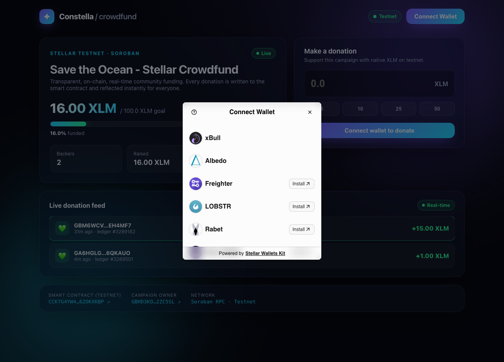
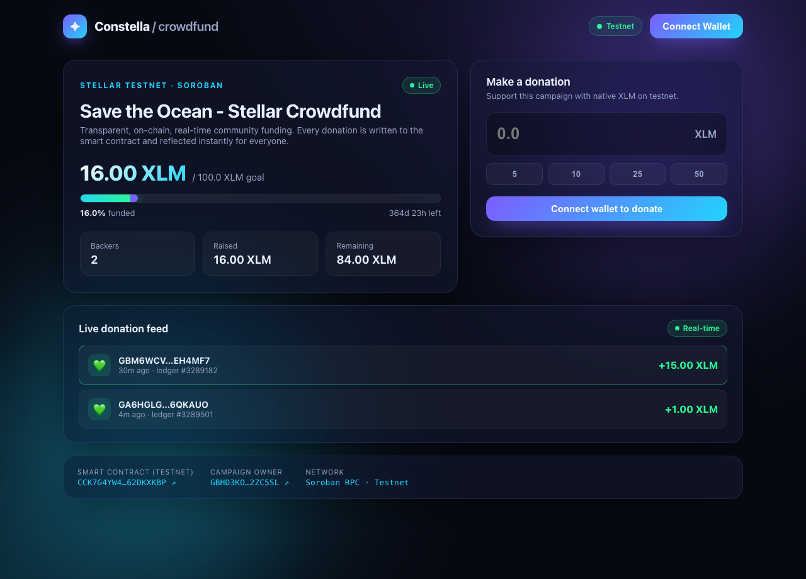
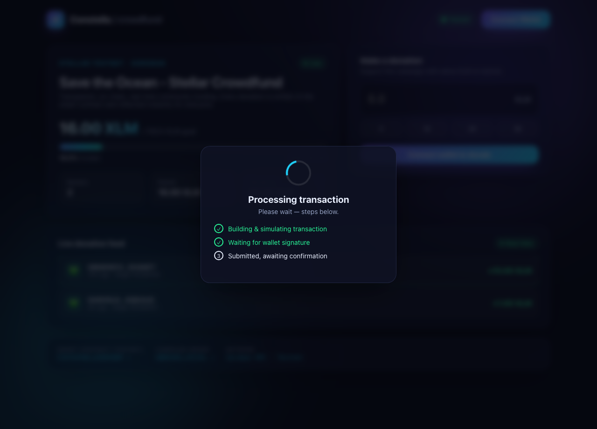
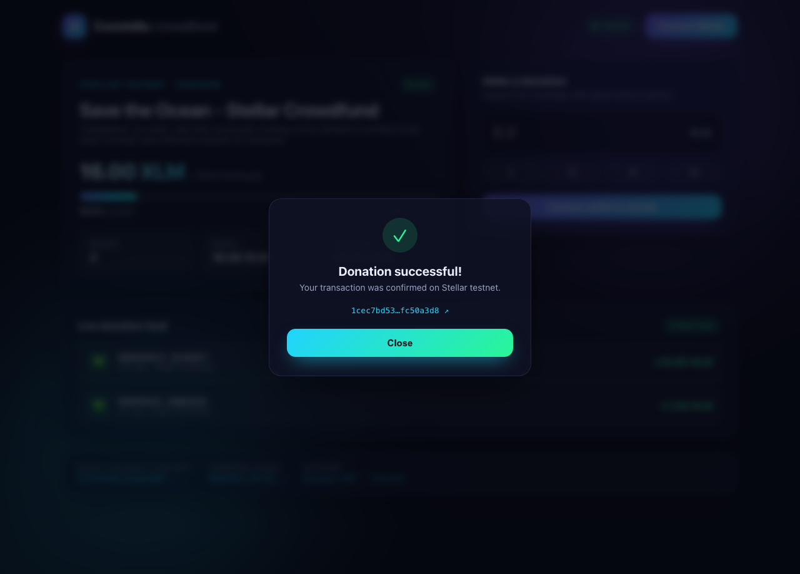

# Constella — Soroban Crowdfunding dApp

> A multi-wallet, **real-time** community crowdfunding app running on a Stellar **Soroban** smart contract. Every donation is written on-chain, contract events stream into a live feed, and the progress bar updates instantly.

Built to satisfy the **Rise In · Stellar — Level 2 (Yellow Belt)** requirements.

**🎥 [Watch the demo video on Loom »](https://www.loom.com/share/602e9d1652694edea987d53f1f175d0f)**

---

## 🔗 Submission Info

| | |
|---|---|
| **🎥 Demo video** | [Watch on Loom](https://www.loom.com/share/602e9d1652694edea987d53f1f175d0f) |
| **Deployed contract (Testnet)** | [`CCK7G4YW4SYV5BEGMIHWRMXHRXYHIB7PIWEO76H7FLJAYSOK62DKXKBP`](https://stellar.expert/explorer/testnet/contract/CCK7G4YW4SYV5BEGMIHWRMXHRXYHIB7PIWEO76H7FLJAYSOK62DKXKBP) |
| **Sample `donate` tx hash** | [`96ae51677ca888c92f48339c27bd9e66541b224e34af0ed9bacea05250b8aae4`](https://stellar.expert/explorer/testnet/tx/96ae51677ca888c92f48339c27bd9e66541b224e34af0ed9bacea05250b8aae4) |
| **Deploy tx hash** | [`97a82189ec0f2d7f12ad6262cf98292a23f1be31e67d62d8ec1f9b5e04e0314a`](https://stellar.expert/explorer/testnet/tx/97a82189ec0f2d7f12ad6262cf98292a23f1be31e67d62d8ec1f9b5e04e0314a) |
| **Network** | Stellar Testnet · Soroban RPC |
| **Donation token** | Native XLM (Stellar Asset Contract) |
| **Live demo** | _(optional — to be added if deployed to Vercel/Netlify)_ |

---

## 📸 Screenshots

### Available wallet options (multi-wallet)
Powered by StellarWalletsKit — Freighter, xBull, Albedo, LOBSTR, Rabet and Hana:



### Main screen — live progress & donation feed


### Transaction status — pending steps


### Transaction status — success


---

## ✨ Features

- **Multi-wallet integration** — connect Freighter / xBull / Albedo / LOBSTR / Rabet / Hana from a single modal via `StellarWalletsKit`.
- **Read & write to the smart contract** — `donate`, `withdraw`, `get_state`, `get_contribution`.
- **Real-time event sync** — polls `DonationEvent` via Soroban RPC `getEvents`; new donations animate into the feed and the progress bar updates live.
- **Transaction status tracking** — every action shows `Building → Signing → Submitted → Success/Error` steps with a verifiable explorer link.
- **3+ error types handled** (see table below).
- **Animated glassmorphism UI** — smooth transitions with Framer Motion, an aurora background and a shimmering progress bar.

---

## 🧯 Handled Error Types

| Scenario | Source | Shown to user |
|---|---|---|
| **Wallet not found** | Selected wallet not installed/enabled | "Wallet not found — install it and try again" |
| **User rejected** | Cancelled in the signing window | "Request rejected" |
| **Insufficient balance** | Not enough XLM / underfunded | "Insufficient balance" |
| **Invalid amount** | Contract `InvalidAmount` (`#3`) | "Donation amount must be greater than 0" |
| **Campaign ended** | Contract `DeadlinePassed` (`#4`) | "The campaign deadline has passed" |
| **Goal not reached** | Contract `GoalNotReached` (`#5`) | "Funds can't be withdrawn before the goal is met" |

Error mapping logic: [`frontend/src/stellar.ts → parseError()`](frontend/src/stellar.ts).

---

## 🏗️ Architecture

```text
.
├── contracts/crowdfunding/        # Soroban smart contract (Rust)
│   ├── src/lib.rs                 # initialize / donate / withdraw / get_state / get_contribution
│   └── src/test.rs                # 7 unit tests (incl. error paths)
├── frontend/                      # React + Vite + TypeScript dApp
│   └── src/
│       ├── wallet.ts              # StellarWalletsKit (multi-wallet)
│       ├── stellar.ts             # contract calls + event polling + error mapping
│       ├── hooks/useCampaign.ts   # real-time state & event sync
│       └── components/            # CampaignCard, DonatePanel, ActivityFeed, TxStatusModal...
├── scripts/deploy.sh              # one-command deploy + initialize
└── README.md
```

### Smart contract functions

| Function | Type | Description |
|---|---|---|
| `initialize(admin, token, title, goal, deadline)` | write | Sets up the campaign |
| `donate(donor, amount)` | write | Transfers token from donor to contract, emits `DonationEvent` |
| `withdraw()` | write | Transfers funds to admin once the goal is reached (`WithdrawEvent`) |
| `get_state()` | read | Goal, raised, backers, deadline, status |
| `get_contribution(donor)` | read | An address's total contribution |

---

## 🚀 Setup

### Prerequisites
- [Node.js](https://nodejs.org) 18+
- [Rust](https://rustup.rs) + the `wasm32v1-none` target
- [Stellar CLI](https://developers.stellar.org/docs/tools/cli) 23+
- A Stellar wallet in the browser (e.g. [Freighter](https://www.freighter.app/)) set to **Testnet**

### 1) Run the frontend
```bash
cd frontend
npm install
cp .env.example .env     # optional — the default contract is already baked in
npm run dev
```
The app opens at `http://localhost:5173`. The contract is already deployed to testnet, so it works **without any extra setup**.

### 2) (Optional) Deploy the contract yourself
```bash
# contract tests
cargo test -p crowdfunding

# build + deploy + initialize in one command (creates a funded testnet identity)
./scripts/deploy.sh

# write the printed CONTRACT_ID into frontend/.env:
#   VITE_CONTRACT_ID=<new_id>
```

### 3) Get testnet XLM
[Freighter](https://www.freighter.app/) → switch network to **Testnet** → "Fund with Friendbot", then donate from the app.

---

## 🔄 How the real-time flow works

1. The user donates → the `donate` call is simulated (auth + `prepareTransaction`).
2. The transaction is signed in the wallet and submitted; status is tracked `pending → success`.
3. The contract emits `DonationEvent { donor, amount, total_raised }`.
4. The frontend polls `getEvents` every 4s with a cursor; new events animate into the **live feed** and `get_state` refreshes so the progress bar updates.

---

## ✅ Level 2 Requirement Checklist

- [x] Multi-wallet integration (StellarWalletsKit)
- [x] 3+ error types handled
- [x] Contract deployed on testnet
- [x] Contract called from the frontend
- [x] Transaction status visible (pending/success/fail)
- [x] Real-time event integration
- [x] 2+ meaningful commits

---

## 🛠️ Tech Stack
Rust · Soroban SDK 25 · Stellar CLI · React 19 · Vite · TypeScript · @stellar/stellar-sdk · @creit.tech/stellar-wallets-kit · Framer Motion
